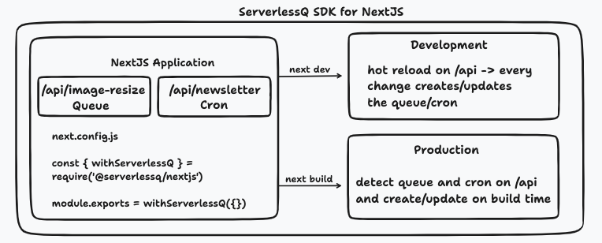

<p align="center">
  <a aria-label="NPM version" href="https://www.npmjs.com/package/@serverlessq/nextjs">
    
  </a>
  <a aria-label="Package size" href="https://bundlephobia.com/result?p=@serverlessq/nextjs">
    
  </a>
  <a aria-label="License" href="https://github.com/vercel/swr/blob/main/LICENSE">
    
  </a>
</p>

## Introduction

`@serverlessQ/nextjs` is a lightweight wrapper to easily utilize the managed queue by [ServerlessQ](https://serverlessq.com).

The SDK is for NextJS projects deployed on Vercel and makes use of Vercel environment variables.

ServerlessQ lets you easily create **Message Queues** and **Cron Jobs** to truly build asynchronous systems.

---

**View full documentation and examples on [docs.serverlessq.com](https://docs.serverlessq.com).**

<br/>

## Installation
Install the library through your desired package manager

```
yarn add @serverlessq/nextjs
```

```
npm i @serverlessq/nextjs
```

```
pnpm i @serverlessq/nextjs
```

<br/>

This library gives you easy access for using [ServerlessQ](https://serverlessq.com).

## Environment Variables

You need to set the `SERVERLESSQ_API_TOKEN` to have access to the system.

1. Create an account at [app.serverlessq.com](https://app.serverlessq.com) and follow the steps described in our [documentation](https://docs.serverlessq.com/sdks/javascript) to get the API token.

> 💡 you can also use our [Vercel Integration](https://vercel.com/integrations/serverlessq) to automate that task 🙂

If you want to use this library locally please create `.env.local` file with the following value:

```bash
SERVERLESSQ_API_TOKEN=
```

New for you? Go check out the official next.js docs on [how to create env files in NextJS](https://nextjs.org/docs/basic-features/environment-variables)

<br/>

## Setup the SDK
Within your `next.config.js` file you need to add the following code:

```ts
const { withServerlessQ } = require('@serverlessq/nextjs')


module.exports = withServerlessQ({
  // your nextjs config
})
```

What does this do? If you are running your NextJS application locally e.g. through `next dev` it will start to watch the `/api` folder for changes. If you import a queue or cron it will automatically create the corresponding API function for you and will update their settings on save. In order to prevent to override production queues/crons it will only create the corresponding resources with a prefix `DEV_` if you are running your application locally. If you create a production build through `next build` it will create the resources without the prefix.



In order to keep track of what resources were created, we take advantage of a `.serverlessq-config.json` file. It is important to commit this file to your repository as it maps your created queue/cron id to the correspoding API function.

## Queue
### Create a Queue from an API Function

Create a new [API Route](https://nextjs.org/docs/api-routes/introduction) within your NextJS application, e.g. `pages/api/queue`.

You can have several queues in multiple queue functions.

```ts
// pages/api/queue
export default Queue({
    options: {
        name: 'SendNewsletter',
        retries: 2
    },
    handler: (req, res) => {
        res.status(200).json({ name: 'John Doe' })
    }
})
```

<br/>

### Enqueue Jobs

You can now easily enqueue jobs by importing your created queue and simple call `.enqueue(...)`.

You can do this either from `getServerSideProps` or from another API function.

```ts
// pages/api/enqueue or getServerSideProps
import { NextApiRequest, NextApiResponse } from 'next'
import testQueue from './queue'

export default async function enqueue(
  req: NextApiRequest,
  res: NextApiResponse
) {
  try {
    const result = await testQueue.enqueue({ method: 'GET' })
    res.json({ status: 'success', ...result })
  } catch (e) {
    res.json({ status: 'failed' })
  }
}
```

## Crons

### Create a Cronjob from an API Function

You need to create the expression according to this [Cron Syntax](https://docs.aws.amazon.com/scheduler/latest/UserGuide/schedule-types.html?icmpid=docs_console_unmapped#cron-based).

```ts
import { Cron } from '@serverlessq/nextjs'

// pages/api/cleanup
export default Cron({
    options: {
        name: 'CleanupDb',
        retries: 3,
        expression: '0 18 ? * MON-FRI *', // runs at 6:00 PM every weekday (Monday through Friday)
        target: 'https://5923-2001-16b8-2ad0-1a00-830-bf28-256f-a5ae.eu.ngrok.io/api/queue',
        method: 'POST',
    },
    handler: (req, res) => {
        // do something
        res.status(200).json({ status: 'OK' })
    }
})
```

<br/>

## Security
Every request from our service contains a specific header `x-serverlessq-signature`. This signature is a hmac hash created from the request target and your API token. We use this signature to verify that the request is coming from our service. If you want to verify the request you can use our implementation `verifySignature` or write your own.

```ts
import { verifySignature, Cron } from '@serverlessq/nextjs'

// pages/api/cleanup
export default Cron({
    options: {
        name: 'CleanupDb',
        retries: 3,
        expression: '0 18 ? * MON-FRI *', // runs at 6:00 PM every weekday (Monday through Friday)
        target: 'https://5923-2001-16b8-2ad0-1a00-830-bf28-256f-a5ae.eu.ngrok.io/api/queue',
        method: 'POST'
    },
    handler: (req, res) => {
        
        if(!verifySignature(req, target)) {
            return res.status(401).json({ status: 'Unauthorized' })
        }

        return res.status(200).json({ status: 'OK' })
    }
})
```
## Types

We have full TypeScript support of course ✨

## Local Development

ServerlessQ runs on the cloud. That means if you work locally on a queue or cron a proxy is necessary to forward your request back to your local machine. In order to ease your life we create a local proxy (by using [localtunnel](https://localtunnel.me/)) for you once you start your development server with `next dev`. 

If you need help with that please contact us! 💬

## Working with Existing Queues

You have also the opportunity to work with existing queues. If you have created a queue from the ServerlessQ UI and simply want to forward messages you can do that.

```ts
// pages/api/existingQueue
import { enqueue } from "@serverlessq/nextjs";
import { NextApiRequest, NextApiResponse } from "next";

export default async function handler(
  _req: NextApiRequest,
  res: NextApiResponse
) {
  try {
    const result = await enqueue({
      target: // TARGET URL,
      method: // HTTP METHOD,
      queueId: // QUEUE-ID,
    });
    res.json({ status: "success", ...result });
  } catch (e) {
    res.json({ status: "failed" });
  }
}
```

You can use the `enqueue` function to directly enqueue a job to a certain `Queue-ID`.

## Verbose Logs
If you encounter errors while using the SDK you can enable verbose logs by setting the environment variable `SLSQ_VERBOSE` to `true` in your `.env.local` file. This will give you more information about the error and the SDK lifecycle. Feel free to attach these logs to your support request.

## Support
If you need help with the SDK or have any questions please contact us at
- Discord
- Issue Tracker on Github

## Milestone

- [x] Enqueue messages with ServerlessQ
- [x] Build Wrapper for NextJS API Routes
- [x] Allow dynamic queue creation
- [x] Allow dynamic creation of cron jobs
- [x] Implement a local proxy for testing queues and crons
- [ ] Add the option for advanced queue options e.g. filter, tags

<br/>

## License

The MIT License.
